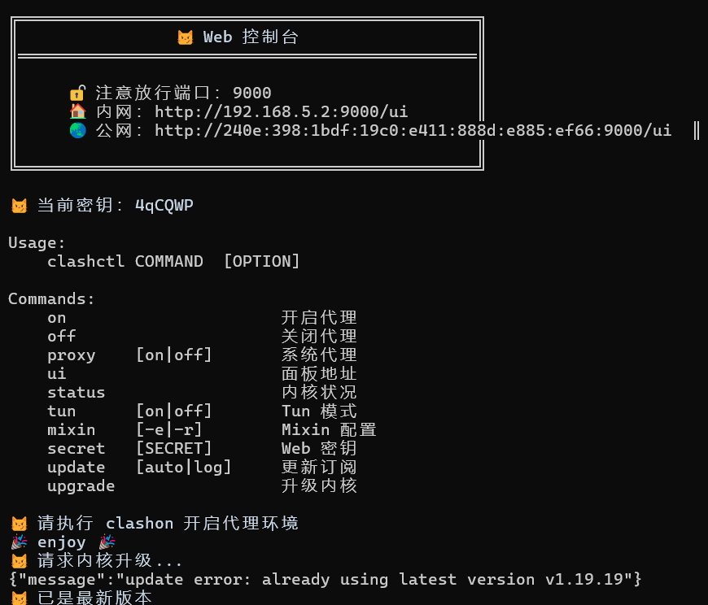
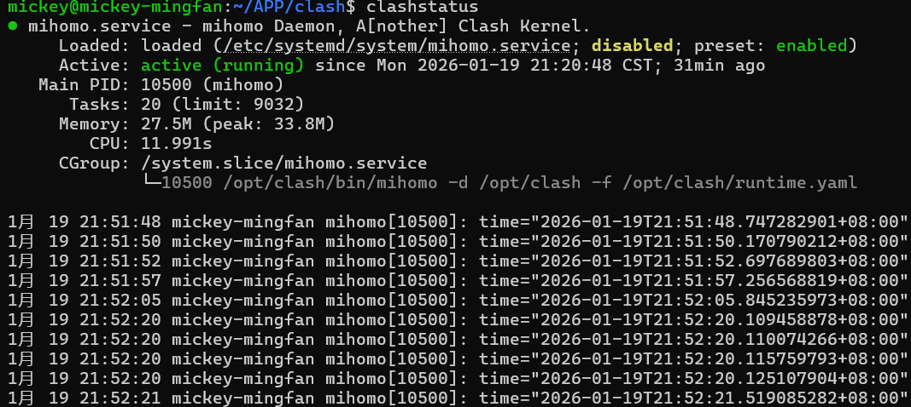
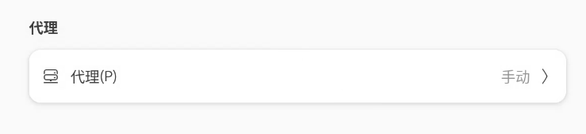
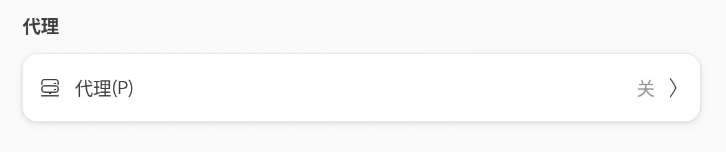

# Linux 一键安装 Clash




- 安装最新稳定版 `mihomo` 内核。
- Web 控制台支持 [metacubexd](https://github.com/MetaCubeX/metacubexd) 和 [zashboard](https://github.com/Zephyruso/zashboard)。
- 支持使用 [subconverter](https://github.com/tindy2013/subconverter) 进行本地订阅转换。
- 多架构支持，适配主流 `Linux` 发行版：`CentOS 7.6`、`Debian 12`、`Ubuntu 22.04.1 LTS`、`Ubuntu 24.04.1 LTS`。

## 说明

本项目来自[clash-for-linux-install](https://github.com/nelvko/clash-for-linux-install)，根据个人需要重新进行了修改，修改地方如下：

1. Web 控制台支持在安装时选择 metacubexd 或 zashboard，安装后也可随时切换。

2. 修复了上游项目兼顾 普通用户 与 `sudo`用户 而造成的命令混乱。

3. mixin.yaml中添加了更为详细的DNS覆写规则和tun规则，支持ipv6，开箱即用。

4. 由我最喜欢的一版代码修改而来，clashstatus命令可以方便查看运行状态。

   

5. 2026.1.20修改：适配linux主流桌面环境，为桌面环境添加系统代理，通过`clashon`、`clashoff`一键控制桌面环境、终端环境代理

## 快速开始

### 环境要求

- 用户权限：`root` 或 `sudo` 用户。
- `shell` 支持：`bash`、`zsh`、`fish`。

### 一键安装

下述命令适用于 `x86_64` 架构

```bash
git clone --branch master --depth 1 https://github.com/Hit-Mickey/clash-for-linux.git clash \
  && cd clash \
  && sudo bash install.sh
```

### 安装资源

安装开始时会提示选择 GitHub 下载方式：

- 输入 `1`：所有 GitHub API 和资源下载均使用官方链接。
- 输入 `2` 或直接回车：使用默认加速地址 `https://gh-proxy.org`。
- 输入 `3`：自定义一个或多个加速地址，多个地址使用分号（`;`）或空格隔开；下载时严格按照填写顺序逐个尝试，不再尝试官方链接。
- 加速配置保存在 `/opt/clash/github-proxy`，安装后可通过 `ghproxy` 查看、通过 `ghproxy -e` 编辑。

安装时还会提示选择 Web 控制面板：输入 `1` 或直接回车选择 metacubexd，输入 `2` 选择 zashboard。安装完成后，`mixin.yaml` 和 `runtime.yaml` 中的 `external-ui` 会明确写入当前面板名称。

每次安装都会下载最新版 `mihomo`、`yq`、`subconverter`、所选面板和 `Country.mmdb`（即 country.mmdb）。subconverter 使用 [tindy2013/subconverter 官方最新 Release](https://github.com/tindy2013/subconverter/releases/latest)。所有配置的下载地址均失败或文件校验失败时，才使用 `resources` 中随仓库提供的对应官方稳定版离线资源。安装后的 Mihomo 与面板均只提供稳定版升级：通过 `clashupgrade` 更新 Mihomo，通过 `clashui upgrade` 更新当前面板。

API 和资源文件下载均不设置 curl 连接超时、总时长或低速限制。

安装完后请通过`clashui`和`clashsecret`查看端口和初始密码

> 如遇问题，请在查阅[常见问题](https://github.com/nelvko/clash-for-linux-install/wiki/FAQ)及 [issue](https://github.com/nelvko/clash-for-linux-install/issues?q=is%3Aissue) 未果后进行反馈。

- 上述克隆命令使用 GitHub 官方地址；安装脚本内的资源下载方式由安装前输入的 GitHub 加速配置决定。
- 默认通过远程订阅获取配置进行安装，本地配置安装详见：在`resources`目录中新建`config.yaml`，将配置粘贴进去再执行安装脚本。
- 没有订阅？[click me](https://wd-gold.net/aff.php?aff=12861)。

### 自定义安装

可以根据需要提前修改 `mixin.yaml` 中的配置，**其中留空的变量名不要随意删除**，也可以在安装完成后修改。安装程序会根据选择明确设置 `external-ui`。

### 命令一览

执行 `clashctl` 列出开箱即用的快捷命令。

```bash
$ clashctl
Usage:
    clashctl    COMMAND [OPTION]
    
Commands:
    on                   开启代理
    off                  关闭代理
    ui       [upgrade|change] 面板地址/更新/切换面板
    ghproxy  [-e]        查看/编辑 GitHub 加速地址
    status               内核状况
    proxy    [on|off]    系统代理
    tun      [on|off]    Tun 模式
    mixin    [-e|-r]     Mixin 配置
    secret   [SECRET]    Web 密钥
    update   [auto|log]  更新订阅
    upgrade              更新 Mihomo 稳定版内核
```

💡`clashon` 等同于 `clashctl on`，`Tab` 补全更方便！

### 优雅启停（终端环境+桌面环境）

```bash
$ clashon
🖥️ 检测到桌面环境，正在设置系统 GUI 代理...
😼 已开启代理环境
```

 

```bash
$ clashoff
😼 已关闭代理环境
```

 

- 启停代理内核的同时，设置系统代理。
- 亦可通过 `clashproxy` 单独控制系统代理。

### Web 控制台

```bash
$ clashui
╔═══════════════════════════════════════════════╗
║                😼 Web 控制台                  ║
║═══════════════════════════════════════════════║
║                                               ║
║     🔓 注意放行端口：9090                      ║
║     🏠 内网：http://192.168.0.1:9090/ui       ║
║     🌏 公网：http://255.255.255.255:9090/ui   ║
║     ☁️ 公共：http://board.zash.run.place      ║
║                                               ║
╚═══════════════════════════════════════════════╝

$ clashsecret 666
😼 密钥更新成功，已重启生效

$ clashsecret
😼 当前密钥：666

$ clashui upgrade
✅ metacubexd 已准备为稳定版 v1.270.6

$ clashui change
当前 Web 控制面板：metacubexd
当前支持的面板：
  1. metacubexd
  2. zashboard
```

- 通过浏览器打开 Web 控制台，实现可视化操作：切换节点、查看日志等。
- `clashui upgrade` 会识别当前选择的面板并检测版本，仅在存在更新时下载对应面板的最新稳定版。
- `clashui change` 会显示当前面板并要求确认。选择相同面板时执行升级，选择不同面板时下载并切换，同时更新 `external-ui` 并重启 Mihomo。
- 面板切换或更新后请强制刷新浏览器缓存。
- 若暴露到公网使用建议定期更换密钥。

### GitHub 加速配置

```bash
$ ghproxy
😼 GitHub 下载：官方链接

$ ghproxy -e
```

- 配置文件每行填写一个 GitHub 加速地址；也支持使用分号或空格分隔；空文件表示只使用 GitHub 官方链接。
- 配置多个地址后，下载和更新会依次尝试这些地址，不再回退到官方链接。
- `ghproxy -e` 保存后立即生效，适用于 `clashupgrade` 和 `clashui upgrade` 等后续下载。

### 更新订阅

```bash
$ clashupdate https://example.com
👌 正在下载：原配置已备份...
🍃 下载成功：内核验证配置...
🍃 订阅更新成功

$ clashupdate auto [url]
😼 已设置定时更新订阅

$ clashupdate log
✅ [2025-02-23 22:45:23] 订阅更新成功：https://example.com
```

- `clashupdate` 会记住上次更新成功的订阅链接，后续执行无需再指定。
- 可通过 `crontab -e` 修改定时更新频率及订阅链接。
- 通过配置文件进行更新：[pr#24](https://github.com/nelvko/clash-for-linux-install/pull/24#issuecomment-2565054701)

### `Tun` 模式

```bash
$ clashtun
😾 Tun 状态：关闭

$ clashtun on
😼 Tun 模式已开启
```

- 作用：实现本机及 `Docker` 等容器的所有流量路由到 `clash` 代理、DNS 劫持等。
- 原理：[clash-verge-rev](https://www.clashverge.dev/guide/term.html#tun)、 [clash.wiki](https://clash.wiki/premium/tun-device.html)。
- 注意事项：[#100](https://github.com/nelvko/clash-for-linux-install/issues/100#issuecomment-2782680205)

### `Mixin` 配置

```bash
$ clashmixin
😼 less 查看 mixin 配置

$ clashmixin -e
😼 vim 编辑 mixin 配置

$ clashmixin -r
😼 less 查看 运行时 配置
```

- 持久化：将自定义配置项写入`Mixin`（`mixin.yaml`），而非原订阅配置（`config.yaml`），可避免更新订阅后丢失。
- 配置加载：代理内核启动时使用 `runtime.yaml`，它是订阅配置与 `Mixin` 配置的合并结果集，相同配置项以 `Mixin` 为准。
- 注意：因此直接修改 `config.yaml` 并不会生效。

### 卸载

```bash
sudo bash uninstall.sh
```

卸载脚本会清除 Mihomo 服务、`/opt/clash`（包括 GitHub 加速配置）、安装时生成的 `resources/bin`、订阅定时任务、Shell/Fish 配置、桌面代理以及 Fish 代理环境临时文件（也会兼容清理旧版 `/var/proxy`）。仓库内自带的离线资源和用户预先放入 `resources/config.yaml` 的配置不会删除。

## 常见问题

[wiki](https://github.com/nelvko/clash-for-linux-install/wiki/FAQ)
